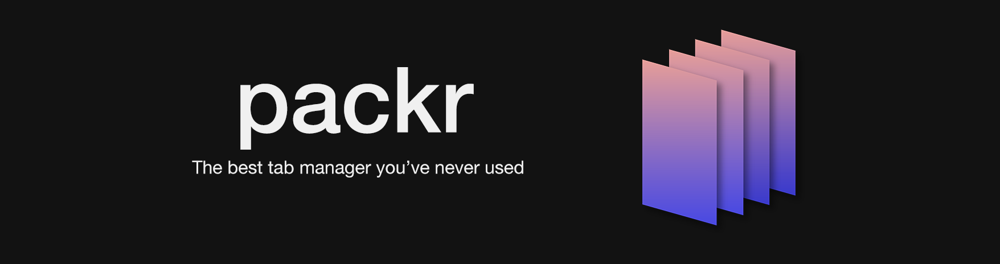
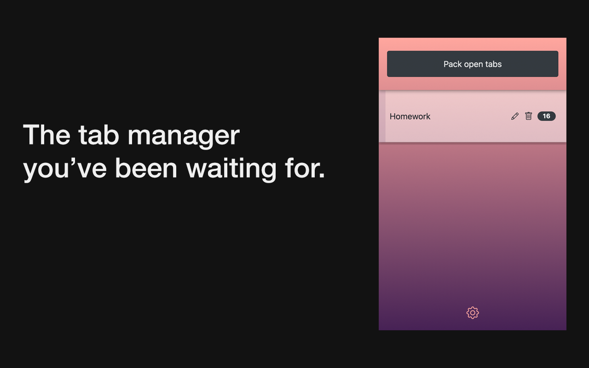
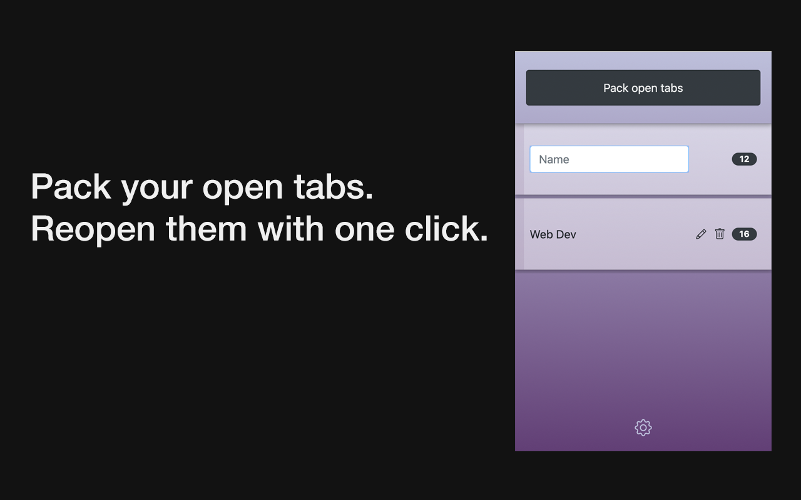
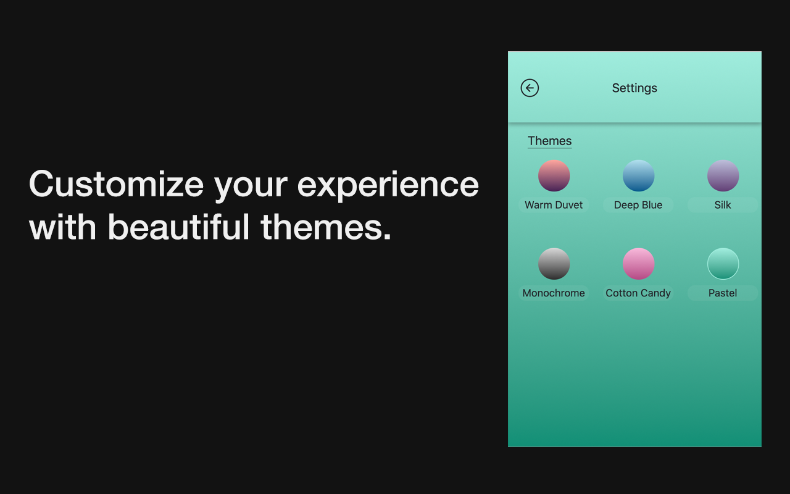

<h1 align="center">
  <p align="center">Packr</p>
  <a href="https://packr.dev"></a>
</h1>

<p align="center">
    <a href="https://packr.dev"></a>
    <a href="https://packr.dev"></a>
    <a href="https://packr.dev"></a>
</p>

## Overview

Packr is a chrome extension for beautifully managing your tabs.

- **Easy to use**

> Packr is design to maximize user experience by reducing the interface down to the necessary elements.

<br><br>

- **Save big on RAM**

> With Packr, you can pack your tabs into groups, allowing you to reopen them with a single click. This allows you to save the RAM all those open Chrome windows are consuming. You are also able to edit invidual packs by adding/removing tabs.

<br><br>

- **Beautiful**

> Packr was developed with design first, allowing it to be the most beautiful tab manager you'll use. The settings expose six different color themes to choose from, fully personalizing your experience.

<br><br>


## Setup

Packr is developed with <a href="https://vuejs.org/">Vue.js</a>, bundled into a Chrome extension using <a href="https://webpack.js.org/">Webpack</a>.

### Installs dependencies
```
npm install
```

### Compiles and hot-reloads for development
```
npm run serve
```

### Compiles and minifies for production
```
npm run build
```

### Lints and fixes files
```
npm run lint
```

## Contributing

> A CONTRIBUTING.md file will soon be shared.

> Unit tests will soon be written and committed, allowing contributions to consistently maintain quality.

## License

GNU General Public License v3.0 or later

See [COPYING](COPYING) to see the full text.